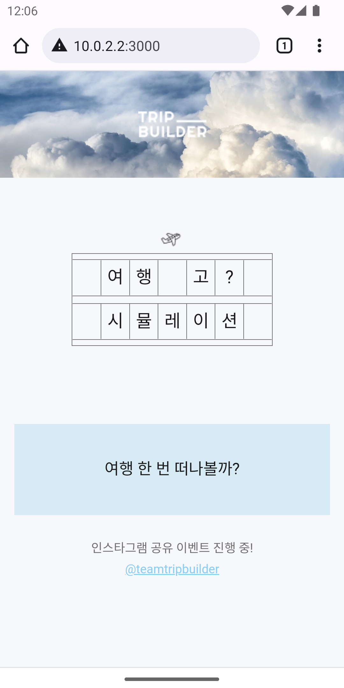

# [여행 고? 시뮬레이션](https://hackathon-frontend-aa5d6jz8b-teamtripbuilder.vercel.app/)

스타트업 [트립빌더](http://www.tripbuilder.co.kr/)에서 "경기콘텐츠진흥원 주관 2021 애자일 해커톤"에 참여하여 제작한 설문조사 기반 여행성향 분석 웹 서비스입니다.

> [!IMPORTANT]\
> 본 웹앱은 모바일에 맞추어 제작되었습니다. 따라서 데스크탑 환경에서는 화면이 늘어나 보일 수 있습니다.

## Tech Stack

- Next.js
- Redux
- victory.js

## Getting Started

```bash
# Install dependencies according to package-lock.json
# It's important to use npm ci instead of npm install
# because npm ci will install exact versions of dependencies
# and it will prevent package-lock.json from being modified
# which prevents potential errors due to dependency version mismatch
npm ci

# Run the development server
npm run dev
```

## Showcase

시작 화면 | 설문 화면 | 결과 화면 (1) | 결과 화면 (2) | 결과 화면 (3)
:---: | :---: | :---: | :---: | :---:
 |  |  |  | 

## Achievements

- 경기콘텐츠진흥원 주관 2021 애자일 해커톤 우수상

